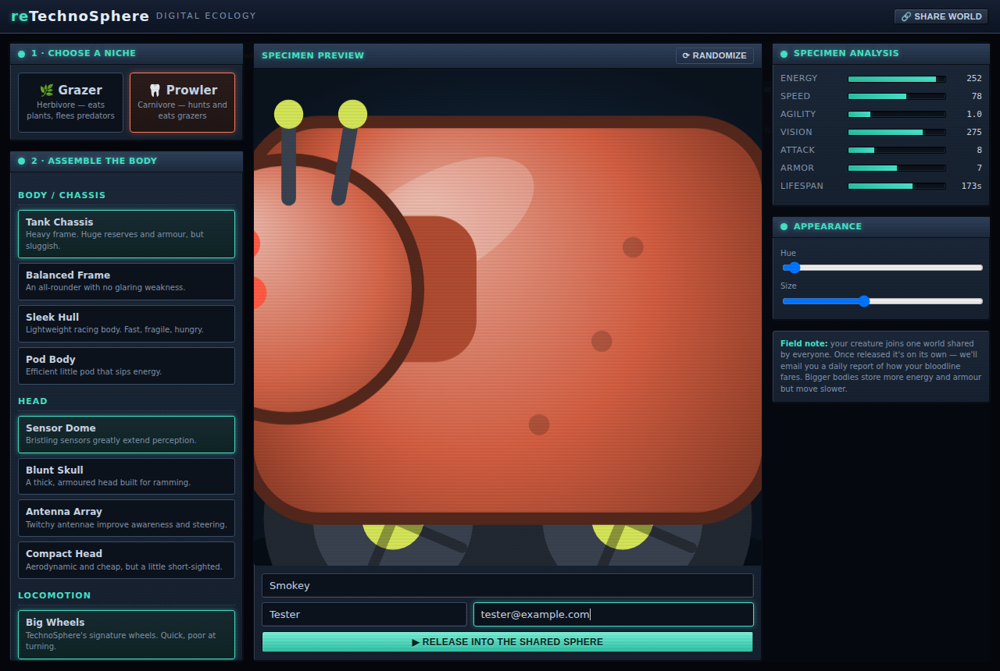
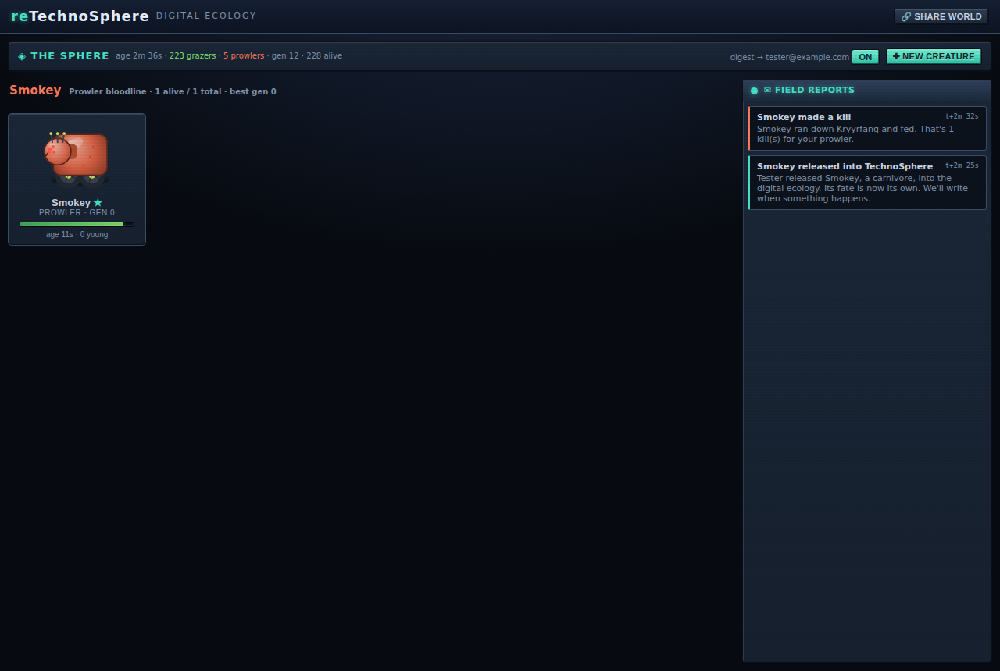
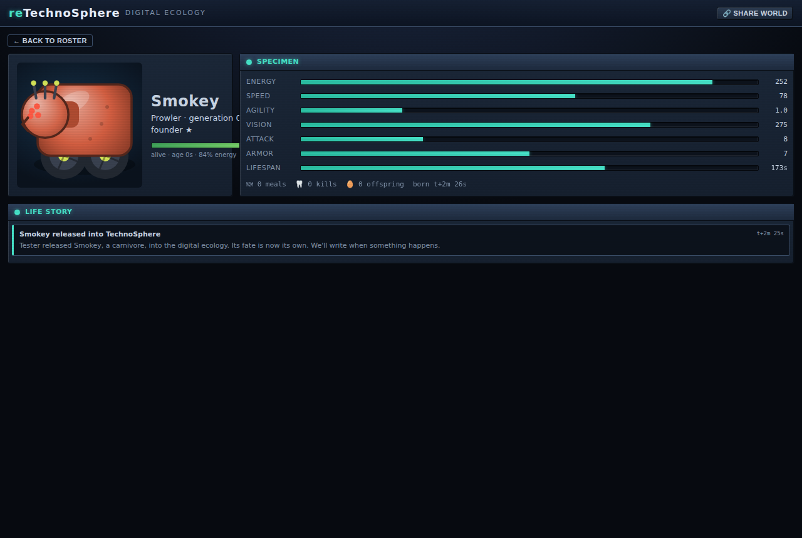

# reTechnoSphere

A recreation of **[TechnoSphere](https://en.wikipedia.org/wiki/TechnoSphere_(virtual_environment))**
(1995–2002) — Jane Prophet & Dr. Gordon Selley's pioneering online "digital
ecology", one of the web's first artificial-life worlds.

Design a creature out of mechanical body parts and release it into **one living
world shared by everyone**. Like the original, you don't watch a map — you keep a
**roster of your creatures** and click one to read its **dossier**: its
encounters, its offspring, its whole life story. The world runs on a server and
**keeps living whether you're watching or not**, and it **emails you** a daily
field report of how your bloodline is faring.





## Features

- **Original-style roster & dossier.** Your bloodlines as a list of creatures
  (alive and dead); click one for its full dossier — stats, parents and offspring
  (navigate the family tree), and a chronological life story of every encounter.
- **One shared, persistent world.** A single Node server owns the simulation and
  saves it to disk. Share the URL and the whole family joins the same ecology.
  Leave and come back — it kept going; after downtime it **fast-forwards** to make
  up the lost time.
- **Creature builder.** Pick a diet (Grazer/Prowler), assemble five body parts
  (each a real stat trade-off), tune colour and size, with a live portrait.
- **Real artificial life.** Energy/metabolism, vision-based sensing, foraging,
  predator/prey chases, fleeing, mating with genetic crossover + mutation,
  budding, ageing and death. Populations oscillate and creatures **evolve across
  generations** with no scripting.
- **Email field reports.** A daily digest summarises what your bloodlines did —
  births, kills, losses, new generations — with one-click unsubscribe. Sends via
  **Gmail** (no domain needed) or **Resend**.
- **Faithful retro look** — shaded, side-on mechanical creatures (the signature
  wheels), beveled panels, CRT scanlines, neon accents.

## Quick start (local)

```bash
npm install
npm run dev      # runs the Vite client (5173) + the world server (8787)
# open http://localhost:5173
```

Without a Resend key, emails run in **dry-run** mode (logged to the console), so
you can exercise the whole flow offline. To try real email locally, copy
`.env.example` to `.env` and set `RESEND_API_KEY`.

Production-style run (one server serving the built client + API):

```bash
npm run build && npm start    # serves on http://localhost:8787
```

Useful scripts:

```bash
npm run typecheck   # strict TS across client, server and scripts
npm run sim:test    # headless engine + snapshot-determinism check (no browser)
```

## How it works

```
Browser (React)  ──/api/creatures────▶  Node server  ──▶  data/ (JSON on disk)
  roster + dossier                      owns the World      world + subscribers
  builder POSTs /api/release            runs the sim loop   + per-creature dossier
  /api/creature/:id, /api/feed          sends digests ──▶ Gmail / Resend
```

- The **simulation engine** (`src/sim/`) is pure, DOM-free TypeScript, so the
  exact same code runs the authoritative world on the server and (only its
  terrain + drawing helpers) in the browser. Terrain is regenerated from the
  world **seed** on both sides, so it's never sent over the wire.
- The server advances the world in real time, **snapshots to disk** every few
  seconds, and on boot **restores + fast-forwards** by the elapsed downtime
  (capped by `CATCHUP_CAP_SECONDS`). Save/restore is verified bit-for-bit by
  `npm run sim:test`.
- Identity is just an **email + display name** (no passwords — a trusted family
  world). Releasing a creature creates/upserts a subscriber and returns a token
  stored in your browser to view "your" bloodlines and manage email prefs.

## Deploy a shareable URL

### Render (recommended)

1. Push this repo to GitHub.
2. In Render: **New → Blueprint**, select the repo (it reads `render.yaml`),
   and apply. This creates an always-on web service with a 1 GB persistent disk
   mounted at `/data`.
3. In the service's **Environment** tab set:
   - `RESEND_API_KEY` — your Resend key
   - `EMAIL_FROM` — e.g. `reTechnoSphere <noreply@yourdomain.com>`
   - `PUBLIC_URL` — the service's URL (e.g. `https://retechnosphere.onrender.com`)
4. Open the URL, build a creature, and **share that URL** with your family.

`ADMIN_SECRET` and `CRON_SECRET` are generated automatically. A persistent disk
requires a paid instance type; free services have no disk and idle when unused
(the world still fast-forwards on the next visit, but won't run while idle).

### Docker / Railway / any host

```bash
docker build -t retechnosphere .
docker run -p 8787:8787 -v retechno-data:/data \
  -e RESEND_API_KEY=re_xxx \
  -e EMAIL_FROM="reTechnoSphere <noreply@yourdomain.com>" \
  -e PUBLIC_URL=https://your.domain \
  retechnosphere
```

On Railway, deploy from the repo and add a **Volume** mounted at `/data`, plus
the same environment variables.

## Email setup

You can send digests **without owning a domain** — use Gmail.

### Gmail (no domain needed — easiest for families)

1. Enable **2-Step Verification** on your Google account.
2. Create an **App Password** at https://myaccount.google.com/apppasswords.
3. Set `GMAIL_USER` (your address) and `GMAIL_APP_PASSWORD` (the app password).
   Digests then send from your Gmail to anyone. SMTP is used automatically when
   these are set (it takes priority over Resend). `EMAIL_FROM` defaults to your
   Gmail address. Any SMTP provider works via the generic `SMTP_*` vars too.

### Resend (Resend setup)

1. Create an account at [resend.com](https://resend.com) and an API key.
2. For real delivery, **verify a domain** and set `EMAIL_FROM` to an address on
   it. (The default `onboarding@resend.dev` only delivers to your own Resend
   account email — fine for a first test.)
3. Set `RESEND_API_KEY` and `PUBLIC_URL`. Digests are sent by the server on a
   schedule; you can also force a send for testing:
   `curl -X POST "$PUBLIC_URL/api/admin/digest?key=$ADMIN_SECRET"`.

## Configuration

| Variable | Default | Purpose |
| --- | --- | --- |
| `RESEND_API_KEY` | — | Resend key; absent → dry-run (logged) email |
| `EMAIL_FROM` | `onboarding@resend.dev` | Sender address |
| `PUBLIC_URL` | — | Base URL for email links |
| `DATA_DIR` | `./data` | Where world/subscribers/events are stored |
| `PORT` | `8787` | Server port |
| `SIM_SPEED` | `1` | World speed vs real time |
| `WORLD_SEED` | random | Fixed seed for the shared world |
| `CATCHUP_CAP_SECONDS` | `3600` | Max sim-time to fast-forward after downtime |
| `DIGEST_INTERVAL_MS` | `86400000` | Min gap between a subscriber's digests |
| `ADMIN_SECRET` / `CRON_SECRET` | — | Protect admin + external cron endpoints |

## API (for reference)

`GET /api/state` · `GET /api/events?lineage=&since=` · `POST /api/release` ·
`GET /api/me?token=` · `POST /api/prefs` · `GET /unsubscribe?token=` ·
`POST /api/cron?key=` · `POST /api/admin/{reset,digest}?key=`

## Project structure

```
src/sim/        pure simulation engine (shared by server + client; serializable)
src/render/     canvas drawing (drawCreaturePortrait — shaded side-on creatures)
src/net/        browser API client
src/components/ React UI (Intro, Builder, CreaturePreview, CreaturePortrait,
                Roster, CreatureDetail, StatBars)
server/         Express server: world manager, storage, email, digests, API
scripts/        simtest.ts (headless engine test), smoke.mjs (Puppeteer e2e)
Dockerfile · render.yaml · .env.example   deployment
```

## Optional end-to-end test

`scripts/smoke.mjs` drives the built app in a headless browser (enter → build →
release → verify live world, inbox and email toggle). Puppeteer isn't a project
dependency (it downloads Chromium), so install it ad-hoc:

```bash
npm i -D puppeteer
npm run build
DATA_DIR=/tmp/d PORT=8899 node --import tsx server/index.ts &   # serve
SMOKE_URL=http://localhost:8899 node scripts/smoke.mjs
```

## Credit

A homage to the original **TechnoSphere** by Jane Prophet and Gordon Selley.
This is an independent fan recreation built from public descriptions of the
project; it shares the concept and spirit, not the original code or assets.
