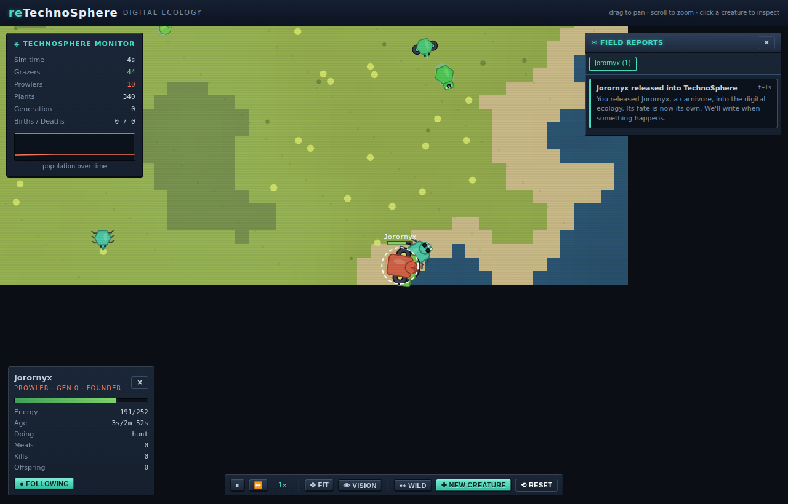

# reTechnoSphere

A recreation of **[TechnoSphere](https://en.wikipedia.org/wiki/TechnoSphere_(virtual_environment))**
(1995–2002) — Jane Prophet & Dr. Gordon Selley's pioneering online "digital
ecology", one of the web's first artificial-life worlds.

In the original, users from around the globe designed creatures out of
mechanical body parts — first choosing **herbivore (Grazer)** or **carnivore
(Prowler)**, then picking a head, body, wheels/legs, eyes and mouth — and
released them into a shared 3D fractal savanna. The creatures then lived
entirely on their own: roaming, grazing or hunting, mating, breeding, evolving
and dying. Famously there was no live view at first — you simply received
**email updates** about your creature's size, offspring and fate.

reTechnoSphere brings that loop back as a single-page web app: build a creature,
release it into a living, evolving world you *can* now watch, and follow your
bloodline through the **Field Reports** inbox.




## Features

- **Creature builder** — choose a diet, assemble five body parts (each a real
  stat trade-off), tweak colour and size, and watch a live preview drawn from
  the exact same code that renders the world.
- **Living world** — a fractal-noise savanna of water, sand, grassland, scrub
  and rock. Plants only grow on fertile ground, so herbivores congregate and
  the terrain actually matters.
- **Artificial-life simulation** — energy/metabolism, vision-based sensing,
  foraging, predator/prey chases, fleeing, mating with genetic crossover +
  mutation, budding, ageing and death. Predator–prey populations oscillate and
  creatures **evolve across generations** with no scripting.
- **Field Reports** — the soul of the original: an inbox of life-event "emails"
  for every bloodline you found ("*Jorornyx made a kill*", "*…has bred —
  generation 7*", "*…was hunted down and eaten*").
- **Faithful retro skin** — beveled metallic panels, CRT scanlines, neon
  accents and Tahoma/monospace type, in the spirit of late-90s/early-2000s
  sci-fi software.

## Running it

```bash
npm install
npm run dev        # start the Vite dev server, then open the printed URL
```

Other scripts:

```bash
npm run build      # type-check + production build into dist/
npm run preview    # serve the production build
npm run typecheck  # strict TypeScript check (app + dev scripts)
npm run sim:test   # headless simulation: run the engine for N sim-seconds and
                   # print population/evolution stats (no browser needed)
```

`npm run sim:test [seed] [seconds]` is handy for tuning the ecological balance —
it runs the pure simulation with no renderer and reports population, births,
deaths and the maximum generation reached.

## How to play

1. **Enter the Sphere** and design your first creature.
2. Pick **Grazer** or **Prowler**, assemble its body, name it, and **Release**
   it. The world is already seeded with wildlife and keeps running underneath
   the builder.
3. **Watch**: drag to pan, scroll to zoom, click any creature to inspect it,
   and toggle **Follow** to track your own. Use the speed control to fast-forward
   evolution.
4. **Read your Field Reports** for word of how your bloodline is faring — and
   release more creatures any time with **✚ New Creature**.

Your creatures are genuinely on their own once released. They may thrive for
many generations, or die out within minutes. Both are authentic TechnoSphere.

## Architecture

The simulation is deliberately separated from React and the renderer, so the
engine is pure, testable TypeScript that runs in Node as easily as in the
browser.

```
src/
  sim/                 # the artificial-life engine (no DOM, no React)
    rng.ts             # seeded PRNG (mulberry32) for reproducible worlds
    vec.ts             # small vector / angle helpers
    constants.ts       # all tunable ecology parameters in one place
    parts.ts           # the body-part catalogue and their stat contributions
    genome.ts          # genome -> derived stats; crossover, mutation, naming
    terrain.ts         # fractal value-noise heightmap -> biomes & fertility
    grid.ts            # uniform spatial hash for "what's near me" queries
    creature.ts        # the creature entity (plain data) + factory
    events.ts          # life-event ("email") types and formatting
    world.ts           # the ecosystem: food, sensing, behaviour, breeding, death
  render/              # canvas drawing (browser only)
    drawCreature.ts    # procedurally draw a creature from its genome
    renderWorld.ts     # terrain cache, plants, creatures, camera, selection
  components/          # React UI
    Intro, Builder, CreaturePreview, StatBars,
    WorldView, Hud, Inbox, Inspector
  styles/retro.css     # the early-2000s skin
scripts/
  simtest.ts           # headless engine smoke test (npm run sim:test)
  smoke.mjs            # optional Puppeteer end-to-end test (see below)
```

### Simulation notes

- The world advances in **fixed time steps** for stability, decoupled from the
  render frame rate; the UI runs one `requestAnimationFrame` loop that both
  steps and draws the world while React only re-renders the overlay panels a few
  times a second.
- Each creature **senses** nearby food, prey, threats and mates through the
  spatial hash, then **decides** a single behaviour per tick (flee > hunt >
  court > forage > wander) and steers toward it, limited by its agility.
- Reproduction is primarily **sexual** (crossover of two genomes + mutation).
  A **budding** fallback lets a thriving loner divide when no mate is near, so
  sparse predators can still grow their numbers and real predator/prey cycles
  emerge. A light stream of wild "immigrants" keeps either population from
  quietly going extinct — echoing the original's constant influx of
  user-created creatures.

## Optional end-to-end test

`scripts/smoke.mjs` drives the built app in a headless browser (intro → build →
release → run), checking for console/network errors and capturing screenshots.
Puppeteer isn't a project dependency (it downloads Chromium), so install it
ad-hoc:

```bash
npm i -D puppeteer
npm run build && npm run preview &   # serve on :4173
node scripts/smoke.mjs
```

## Credit

A homage to the original **TechnoSphere** by Jane Prophet and Gordon Selley.
This is an independent fan recreation built from public descriptions of the
project; it shares the concept and spirit, not the original code or assets.
